 

**B.E. ECE undergraduate** (2024–2028) at Sathyabama Institute of Science
and Technology, working under Dr. G. Rajalakshmi. Focused on hardware
security, FPGA design, and digital signal processing.

Targeting direct-to-industry hardware roles — Samsung, Apple, AMD, Intel,
Qualcomm, MediaTek. Not pursuing grad school.

[GitHub](https://github.com/krss-94) — [LinkedIn](https://www.linkedin.com/in/siva-srinivas-8ab29a324/) — [Email](mailto:sivasrinivasccvv@email.com)

 

---

## 01 — Projects

**FPGA Masked-Share Routing — Physical Isolation Limits**
Investigated physical isolation of masked shares on Xilinx/AMD FPGAs,
building masked AND, XOR, and NAND gadgets and evaluating placement and
routing separation. Built a RapidWright-based switch-box/tile conflict
detector that identified 28 cross-share routing conflicts across 67 tiles,
reducing them to 2 physical locations in under 3 seconds. Evaluated
mitigation via Vivado rerouting and custom PIP-level graph search.
Verilog · Vivado · RapidWright · Python
→ [repo](https://github.com/krss-94/fpga-masked-share-routing)

**RSD — RISC-V Memory Dependency Predictor Hardware-Cost Study**
Established and verified a 1024×1-bit memory-dependency predictor
baseline — 50 LUTs, 14 registers, 32 LUTRAMs, 0 BRAMs. Timing and Fmax
analysis put a fixed-placement lower bound around 52.6 MHz, with the
critical path traced to fpExStage bypass-network fanout rather than the
predictor itself. Validated with Verilator across targeted workloads,
including 11 memory-dependency misprediction events. Extending to wider
predictor configurations as ongoing work.
SystemVerilog · Vivado · Verilator · Zedboard

**PAIRS** — Phase Artifact Reduction Using Interpolation and Re-Sampling
Multirate phase-vocoder pitch-shifting algorithm reducing transient
pre-echo artifacts against standard phase-vocoder baselines. Fixed L=2
architecture with Kaiser-windowed LPF and radix-2 FFT, ported to C on the
TMS320C6748 DSP kit.
*IEEE — under review*
C

 

---

## 02 — Stack

**Languages** C, Python, Java
**Hardware** ESP32, Arduino Uno, Raspberry Pi, TMS320C6748 DSP Kit, LoRa Ra-02
**Digital Design / FPGA** Verilog, RTL Design, Vivado
**Tools** Git, RapidWright, Verilator
**Signal Processing** FFT, FIR/IIR Filters, Phase Vocoder, TKEO

 

---

## 03 — GitHub

  

<strong>SIVA SRINIVAS</strong>

  

<picture>
  <source media="(prefers-color-scheme: dark)" srcset="https://raw.githubusercontent.com/krss-94/krss-94/output/dist/github-snake-dark.svg"/>
  
</picture>

 

---

Open to hardware and embedded roles. Research collaboration welcome.
